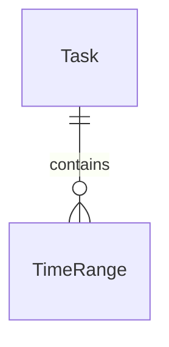
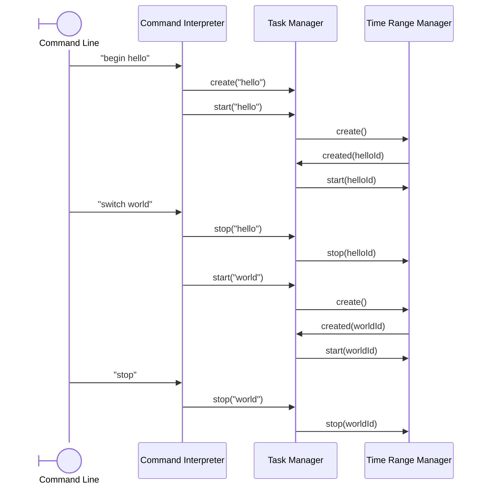

CLI application for time tracking.

# Functionalities

## Must have

- Create a task
- Switch between tasks
- Start tracking time
- Stop tracking time
- Show the time spent on a task

## Should have

- Remove a time range
- Update a time range
- Create a new time range
- Attribute a time range to another task

## Nice to have

- Tasks automatically follow the open git repository and branch
- Add reminders for events
- Export tasks and reminders as iCalendar

# Technologies

- Local CLI application written in Golang
- Data persisted in an SQLite file
- Single user, no password to protect the data

# Architecture

## Command Interpreter

The _command interpreter_ parses user input and sends the appropriate command to the _task manager_.

To facilitate its usage, the _command interpreter_ remembers the last task written by the user. For example, when a command "start hello" is followed by "stop", the last command is interpreted as "stop hello"

The following commands are supported:

- **create [name]**: create the task _name_
- **start [name]**: start a new time range entry for _name_
- **stop [name]**: stop the last time range entry for _name_
- **begin [name]**: shortcut for _create_ and _start_
- **delete [name]**: delete the task _name_
- **list**: list all tasks and their duration

## Task Manager

The _task manager_ manages tasks. Each task can be seen as a named collection of time ranges.

The task manager interacts with the _time range manager_ to manage the time ranges attributed to the task. It also calculates the duration of the task.

## Time Range Manager

The _time range manager_ manages time ranges. It makes sure that a time range is always attributed to a task, and calculates the duration of its range.

# Diagrams

## Relations

## Sequence

