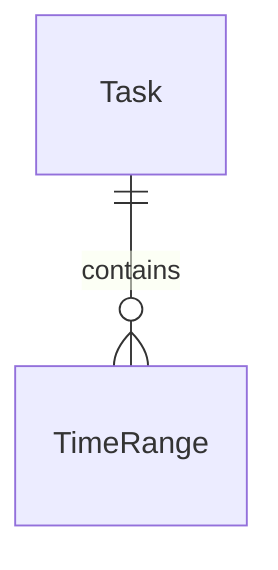
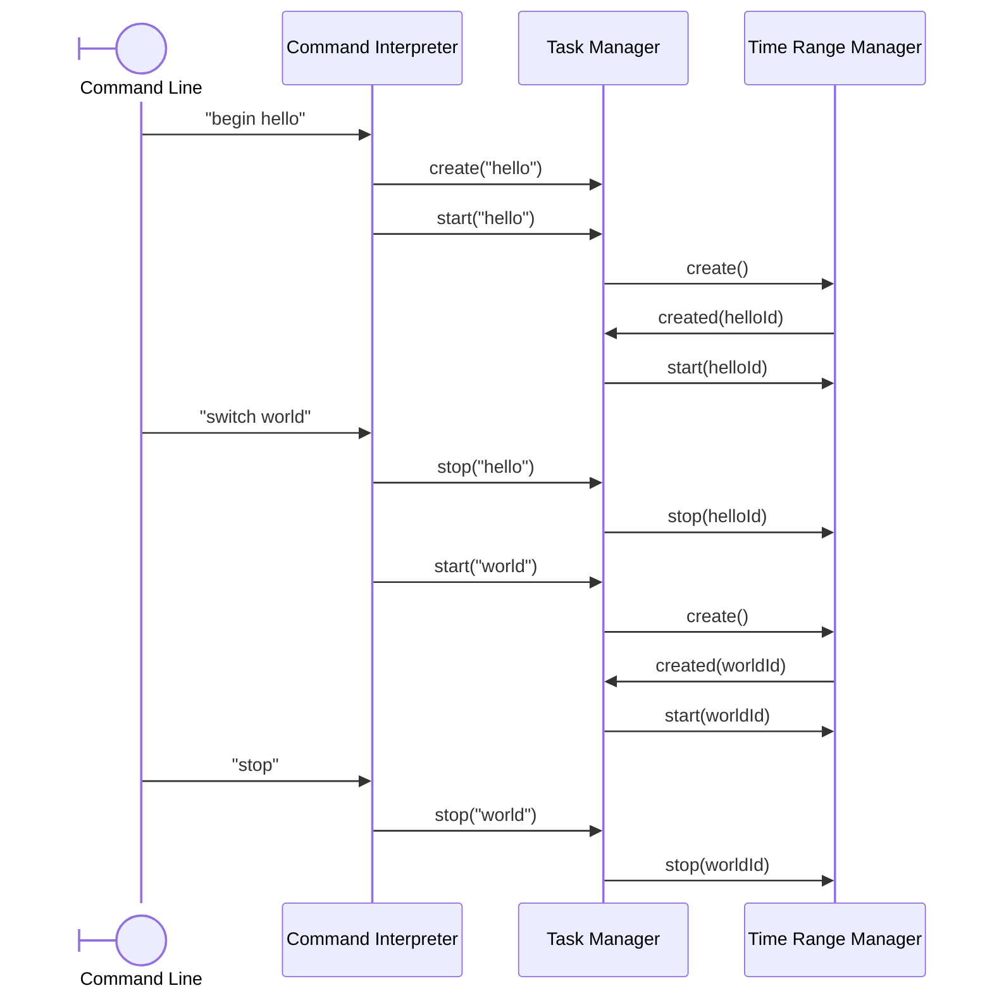

CLI application for time tracking.

# Functionalities

## Must have

- Create a task
- Switch between tasks
- Start tracking time
- Stop tracking time
- Show the time spent on a task

## Should have

- Remove a time range
- Update a time range
- Create a new time range
- Attribute a time range to another task

## Nice to have

- Tasks automatically follow the open git repository and branch
- Add reminders for events
- Export tasks and reminders as iCalendar

# Technologies

- Local CLI application written in Golang
- Data persisted in an SQLite file
- Single user, no password to protect the data

# Architecture

## Entities

Entities are the basic building blocks of the application. Some entities, such as DbId, are simple aliases to native types. Others are interfaces implemented by structures, such as Tasker and TimeRanger.

They are responsible for handling the logic of individual entities (e.g. a *time range* cannot end before it started)

## Managers

The _task manager_ and *time range manager* manage, respectively, the tasks and time ranges. They are responsible to handle the logic of the tasks and time ranges as a whole (e.g. list all the tasks)

## Repositories

*task manager* and *time range manager* each have a corresponding repository. These repositories are responsible for interacting with an SQLite database to retrieve and persist the data handled by the managers. They do not handle logic per say.

## Command Interpreter

The _command interpreter_ parses user input and sends the appropriate command to the _task manager_.

To facilitate its usage, the _command interpreter_ remembers the last task written by the user. For example, when a command "start hello" is followed by "stop", the last command is interpreted as "stop hello"

The following commands are supported:

- **create [name]**: create the task _name_
- **start [name]**: start a new time range entry for _name_
- **stop [name]**: stop the last time range entry for _name_
- **begin [name]**: shortcut for _create_ and _start_
- **list**: list all tasks and their duration

# Diagrams

## Relations

## Sequence

