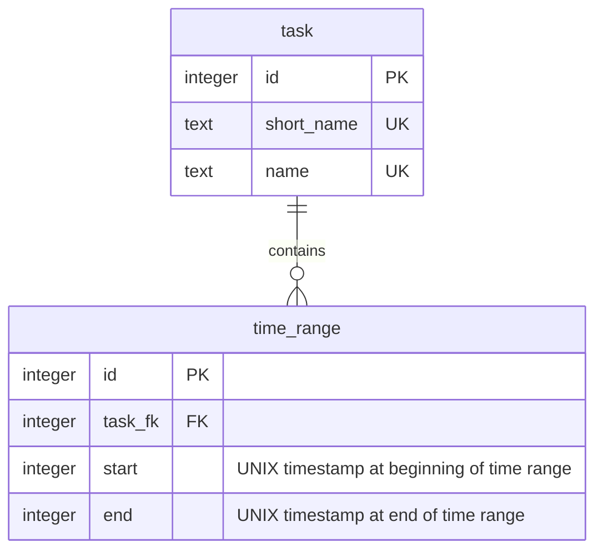
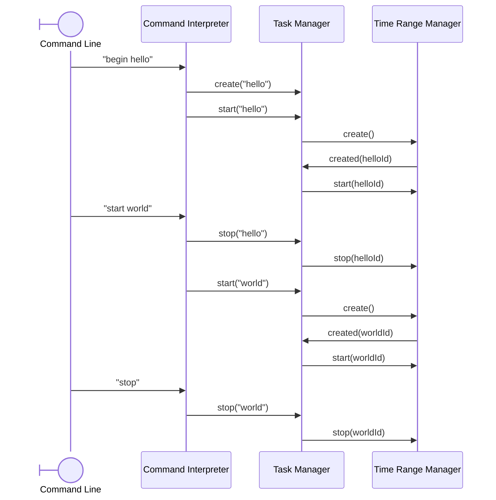

# CLI application for time tracking

Suppose you want to track the time spent reading your emails every day.

1. create a task `create email Reading my emails`.
    - keyword: create
    - short name: email
    - name: Reading my emails
2. start the task when you start reading your emails: `start email`
    - Note: If email is the current task, you can simply write `start`
3. stop the task when you finished reading your emails: `stop email`
    - Note: usually you want to stop the current task, so you can write `stop`

```sh
> begin mytask My task█

--------------------
Current task: 01:00:15 [task] Another task

 00:12:13 [task3] Task number three
 00:21:42 [task4] Task number four
```

## Functionalities

- Create a task
- Switch between tasks
- Start tracking time
- Stop tracking time
- Show the time spent on a task
- Rename a task

## Technologies

- Local CLI application written in Golang
- Data persisted in an SQLite file
- Single user, no password to protect the data

## Code architecture

The timetracker manages a list of tasks. Each task consist of a short name, a name, and time ranges. The user chooses the short name and the name, while the time ranges are created as the user starts and stops tasks.

### Entities

Entities are the basic building blocks of the application, such as tasks and time ranges. Some entities, such as DbId, are simple aliases to native types. Others are interfaces implemented by structures, such as Tasker and TimeRanger.

They are responsible for handling the logic of individual entities (e.g. a *time range* cannot end before it started)

### Managers

The *task manager* and *time range manager* manage, respectively, the tasks and time ranges. They are responsible to handle the logic of the tasks and time ranges as a whole (e.g. list all the tasks)

### Repositories

*task manager* and *time range manager* each have a corresponding repository. These repositories are responsible for interacting with an SQLite database to retrieve and persist the data handled by the managers. They do not handle business logic.

### Command Interpreter

The *command interpreter* parses user input and sends the appropriate command to the *task manager*.

To facilitate its usage, the *command interpreter* remembers the last task written by the user. For example, when a command "start hello" is followed by "stop", the last command is interpreted as "stop hello"

The following commands are supported:

## Commands

- **create [short_name] [name]**: create the task *name* with the short name *short_name*
- **rename [short_name] [new_short_name] [new_name]**: rename the task *short_name* to *new_short_name* *new_name*
- **start [short_name]**: start a new time range entry for *short_name*
- **stop [short_name]**: stop the last time range entry for *short_name*
- **begin [short_name]**: shortcut for *create* and *start*
- **delete [short_name]**: delete the task *short_name*
- **list**: list all tasks and their duration
- **exit**, **quit**: stop the current task and exit the application

> note: the [short_name] can be omitted when there's a current task, except for *rename*

## Shortcuts

- **ctrl+v**, **ctrl+shift+v**: paste from clipboard
- **ctrl+l**: clear the line
- **ctrl+c**: stop the current task and exit the application

## Diagrams

### Database



### Sequence



## Explore time ranges (WIP)

If you've made a mistake with a time range (e.g. you forgot to stop it on time), you can modify existing time ranges using the command `tr`. It also gives the time spent on one or several tasks within a time period. Note that every command requires an `=` sign.

- **tr**: indicates that the view should switch to time ranges.
- **tasks=[short_names]**: list the time ranges of the required tasks. Separate the short names by a comma and without spaces to list multiple tasks (e.g. `review,weekly`) If *short_name* is omitted, time ranges of all tasks are listed.
- **from=[start_date]**: list the time ranges from the specified date. Use the format *YYYY-MM-DDThh:mm:ss*. You can specify only the most general a part of a date. If that's the case, month and day are considered to be "01", whereas hours, minutes and seconds are considered to be "00". This argument can be combined with the argument `to`.
- **to=[end_date]**: list the time ranges until the specified date. Use the format *YYYY-MM-DDThh:mm:ss*. You can specify only the most general part of a date. In such case, month and day are considered to be "12" and "31", whereas hours, minutes and seconds are considered to be "23", "59" and "59". This argument can be combined with the argument `from`.
- **week=[YYYY-Www]**: set the time range to a given week. For example, 2000-W01 gives the first week of the year 2000, that is the  2000-01-03 to 2000-01-09. Note that the week starts on January 3rd, because in the ISO 8601 weekly calendar, January 1st and 2nd are part of the year 1999.
- **week=[YYYY-Www-D]**: set the time range to a given day, using the weekly ISO 8601 calendar. For example, 2000-W01-1 indicate the monday of the first week of the year 2000, which is 2000-01-03.

```sh
> tr tasks=review,weekly from=2000 to=2001

--------------------
tasks: review,weekly
from: 2000-01-01T00:00:00
to: 2001-12-31T23:59:59
Total time: 02:15

1 <-- identifier of this time range
- 2026-01-01T10:00:00 start weekly 
| 2026-01-01T10:15:00 switch 336-fksnaeufdjaklfnweaufasfs
| 2026-01-01T10:26:00 switch 445-fijaifhdasfjklawehrfdfas
- 2026-01-01T12:00:00 stop weekly

| 2026-01-01T12:05:00 switch 556-kfnskafjslafjslkfs
| 2026-01-01T14:56:00 switch 445-fsfneafjafsd

2
- 2026-01-01T15:00:00 start review
- 2026-01-01T16:00:00 stop review
```

Once we are inside the time range GUI, you can use the following commands to modify the filters. Note that the equal sign isn't necessary anymore. You can change only one at a time.

- **from [date]**: change the first starting date.
- **to [date]**: change the last ending date.
- **week [weekly_date]**: change both the start and end dates, according to the ISO 8601 weekly calendar.
- **tasks [short_names]**: change the tasks included in the result.
- **exit**: return to the list of tasks

```sh
> week 2000-W01

--------------------
tasks: review,weekly
from: 2000-01-03T00:00:00
to: 2001-01-09T23:59:59
Total time: 02:15

1 <-- identifier of this time range
- 2026-01-01T10:00:00 start weekly 
| 2026-01-01T10:15:00 switch 336-fksnaeufdjaklfnweaufasfs
| 2026-01-01T10:26:00 switch 445-fijaifhdasfjklawehrfdfas
- 2026-01-01T12:00:00 stop weekly

| 2026-01-01T12:05:00 switch 556-kfnskafjslafjslkfs
| 2026-01-01T14:56:00 switch 445-fsfneafjafsd

2
- 2026-01-01T15:00:00 start review
- 2026-01-01T16:00:00 stop review
```

## Modify a time range (WIP)

From the time range view, use the command `mod [identifier]` to modify a time range. Note that every argument requires an `=` sign.

- **mod [identifier]**: main command to modify a time range. The identifier is displayed in the list of time ranges.
- **start=[YYYY-MM-DDThh:mm:ss]**: the start date of the time range. This argument can be combined with `end`.
- **end=[YYYY-MM-DDThh:mm:ss]**: the end date of the time range. This argument can be combined with `start`.
- **delete**: delete a time range. Must be the only argument.

```sh
> mod 1 start=2000-01-02T10:15:00 end=2000-01-02T12:30:00

--------------------
tasks: review,weekly
from: 2000-01-03T00:00:00
to: 2001-01-09T23:59:59
Total time: 02:15

1 <-- identifier of this time range
- 2000-01-02T10:15:00 start weekly 
| 2026-01-01T10:15:00 switch 336-fksnaeufdjaklfnweaufasfs
| 2026-01-01T10:26:00 switch 445-fijaifhdasfjklawehrfdfas
- 2000-01-02T12:30:00 stop weekly

| 2026-01-01T12:05:00 switch 556-kfnskafjslafjslkfs
| 2026-01-01T14:56:00 switch 445-fsfneafjafsd

2
- 2026-01-01T15:00:00 start review
- 2026-01-01T16:00:00 stop review
```
