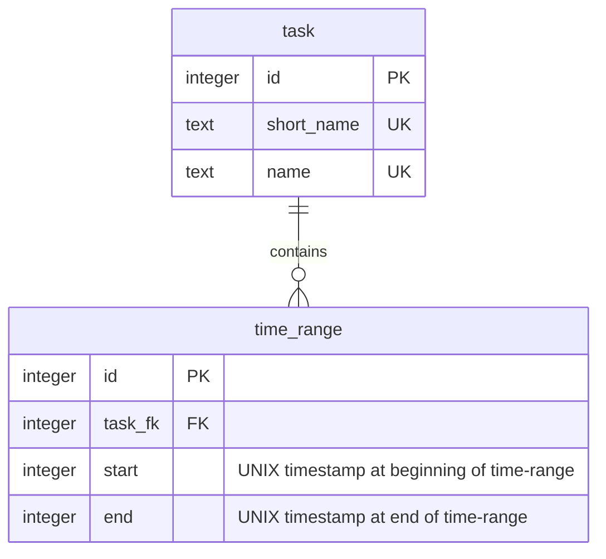
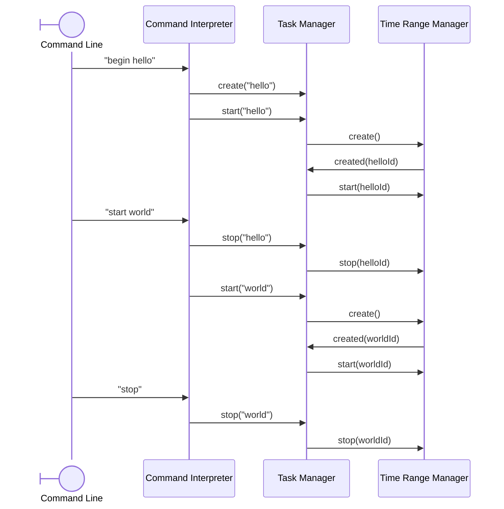

# CLI application for time tracking

Suppose you want to track the time spent reading your emails every day.

1. create a task `create email Reading my emails`.
    - keyword: create
    - short name: email
    - name: Reading my emails
2. start the task when you start reading your emails: `start email`
    - Note: If email is the current task, you can simply write `start`
3. stop the task when you finished reading your emails: `stop email`
    - Note: usually you want to stop the current task, so you can write `stop`

```sh
> begin mytask My task█

--------------------
Current task: 01:00:15 [task] Another task

 00:12:13 [task3] Task number three
 00:21:42 [task4] Task number four
```

## Functionalities

- Create a task
- Switch between tasks
- Start tracking time
- Stop tracking time
- Show the time spent on a task
- Rename a task

## Technologies

- Local CLI application written in Golang
- Data persisted in an SQLite file
- Single user, no password to protect the data

## Code architecture

The timetracker manages a list of tasks. Each task consist of a short name, a name, and time ranges. The user chooses the short name and the name, while the time ranges are created as the user starts and stops tasks.

### Entities

Entities are the basic building blocks of the application, such as tasks and time ranges. Some entities, such as DbId, are simple aliases to native types. Others are interfaces implemented by structures, such as Tasker and TimeRanger.

They are responsible for handling the logic of individual entities (e.g. a *time range* cannot end before it started)

### Managers

The *task manager* and *time range manager* manage, respectively, the tasks and time ranges. They are responsible to handle the logic of the tasks and time ranges as a whole (e.g. list all the tasks)

### Repositories

*task manager* and *time range manager* each have a corresponding repository. These repositories are responsible for interacting with an SQLite database to retrieve and persist the data handled by the managers. They do not handle business logic.

### Command Interpreter

The *command interpreter* parses user input and sends the appropriate command to the *task manager*.

To facilitate its usage, the *command interpreter* remembers the last task written by the user. For example, when a command "start hello" is followed by "stop", the last command is interpreted as "stop hello"

The following commands are supported:

## Commands

- **create [short_name] [name]**: create the task *name* with the short name *short_name*
- **rename [short_name] [new_short_name] [new_name]**: rename the task *short_name* to *new_short_name* *new_name*
- **start [short_name]**: start a new time range entry for *short_name*
- **stop [short_name]**: stop the last time range entry for *short_name*
- **begin [short_name]**: shortcut for *create* and *start*
- **delete [short_name]**: delete the task *short_name*
- **list**: list all tasks and their duration
- **exit**, **quit**: stop the current task and exit the application

> note: the [short_name] can be omitted when there's a current task, except for *rename*

## Shortcuts

- **ctrl+v**, **ctrl+shift+v**: paste from clipboard
- **ctrl+l**: clear the line
- **ctrl+c**: stop the current task and exit the application

## Diagrams

### Database



### Sequence


